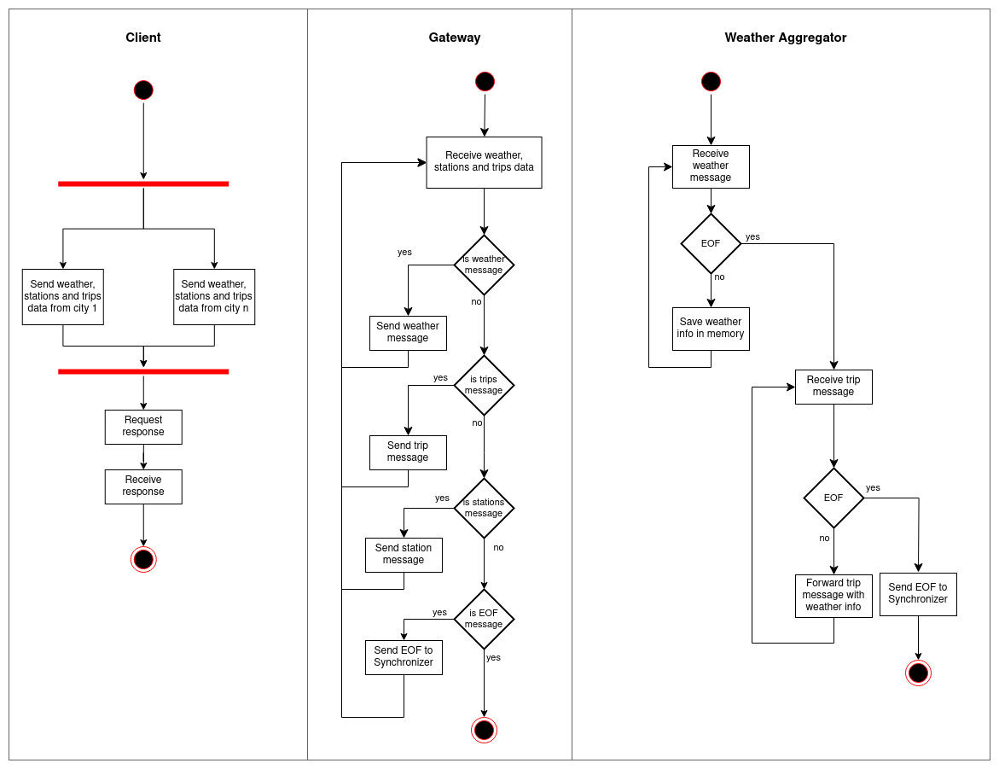

# TP1 - Sistemas Distribuidos I

## Tabla de contenidos

* [Documentación](#documentación)
  * [Scope](#scope)
  * [Software Architecture](#software-architecture)
  * [Architectural goals & Constraints](#architectural-goals-&-constraints)
  * [Scenarios](#scenarios)
  * [Logical View](#logical-view)
    * [DAG](#dag)
  * [Physical View](#physical-view)
    * [Diagrama de robustez](#diagrama-de-robustez)
    * [Diagrama de despliegue](#diagrama-de-despliegue)
  * [Process View](#process-view)
    * [Diagrama de actividad](#diagrama-de-actividad)

## Documentación

### Scope

El proyecto consiste en un sistema distribuido que analice los registros de viajes
realizados con bicicletas de la red pública provista por grandes ciudades.

Se deben generar los siguientes reportes:

- La duración promedio de viajes que iniciaron en días con
precipitaciones >30mm.
- Los nombres de estaciones que al menos duplicaron la cantidad de
viajes iniciados en ellas entre 2016 y el 2017.
- Los nombres de estaciones de Montreal para la que el promedio de
los ciclistas recorren más de 6km en llegar a ellas.

### Software Architecture

La arquitectura es de tipo cliente-servidor, donde el servidor consiste en
diferentes entidades, comunicadas entre sí mediante el broker de mensajes
RabbitMQ.

### Architectural goals & Constraints

- **Escalabilidad**: Se debe soportar el incremento de los elementos de cómputo para
escalar los volúmenes de información a procesar.
- **Mantenibilidad**: La comunicación de grupos debe encapsularse en un middleware.

### Scenarios

Diagrama de casos de uso del sistema.

### Logical View

#### DAG

DAG global del sistema.

En el diagrama se puede observar la división de responsabilidades entre los distintos componentes
del sistema. En primer lugar, el Gateway se encarga de distribuir la información recibida del cliente,
entre los aggregators. Cada aggregator opera con una side table que contiene un pequeño conjunto de
datos estáticos. Por ejemplo, `WA Weather Aggregator` contiene la información climática de
Washington.

Para disminuir el tamaño de los mensajes que debe procesar RabbitMQ, el Gateway poda todos los
campos que no son necesarios para calcular los reportes.
Por ejemplo, el Gateway recibe una gran cantidad de información climática, pero el sistema solo
necesita la precipitación. Por lo tanto, el Gateway elimina todos los campos que no son necesarios
antes de enviar la información al aggregator.

La información de las side tables se ingresa al sistema mediante un mecanismo de pub-sub, para
permitir que varias réplicas de los aggregators puedan construir sus side tables.
Esto favorece la escalabilidad del sistema, a costa de duplicar la información en cada réplica.

### Physical View

#### Diagrama de robustez

Diagrama de robustez del sistema.

Como se puede ver, tanto los aggregators, como los filtros y distance calculators, se pueden
escalar horizontalmente.
Los providers, por otro lado, realizan tareas que requieren información de un conjunto de datos
de los viajes, por lo que consisten en una sola instancia. Por ejemplo, el `Avg Provider`, encargado
de satisfacer el primer reporte, debe tener la información de todos los viajes de un determinado día,
para poder calcular el promedio. Si se realizara un escalado de la misma forma que los otros
componentes, existiría la posibilidad de que varias instancias calculen un promedio parcial, lo cual
no es correcto.

#### Diagrama de despliegue

Diagrama de despliegue del sistema.

Este diagrama pone en evidencia la fuerte dependencia que existe entre RabbitMQ (Message Queue) y
los diferentes componentes del sistema.
Para alivianar la carga del broker, el cliente y el Gateway se comunican directamente entre sí. 
Cada nodo puede desplegarse de manera independiente.

### Process View

#### Diagrama de actividad

Diagrama de actividad de la comunicación entre el cliente, el Gateway y el primer aggregator.

En el diagrama anterior se puede observar el orden en que el cliente envía la información al Gateway, y
el orden en que la esperan los aggregators.
Por un lado, el cliente envía la información del clima, estaciones y viajes.
El `Weather Aggregator` necesita la información climática para armar su side table, por lo que no puede
procesar la información de los viajes hasta que no reciba todos los datos del clima.
Lo mismo sucede con el `Station Aggregator`, que necesita la información de las estaciones.

Diagrama de actividad de la comunicación entre el `Station Aggregator`, `Prec Filter` y `Avg Provider`.

En el diagrama se visualiza como se resuelve el primer reporte, desde el momento en que se termina de
agregar la información de las estaciones y el clima.

Para los otros dos reportes, el mecanismo es muy similar: el aggregator envía la información del viaje a
una entidad que se puede escalar (`Year Filter` o `Distance Calculator`), y ésta a su vez la envía al provider
correspondiente (`Dist Mean Provider` o `TripsCount Provider`).

