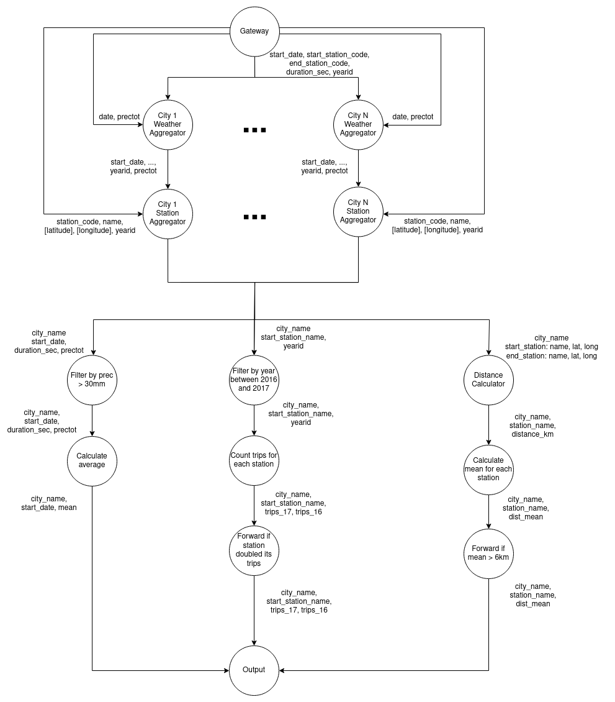
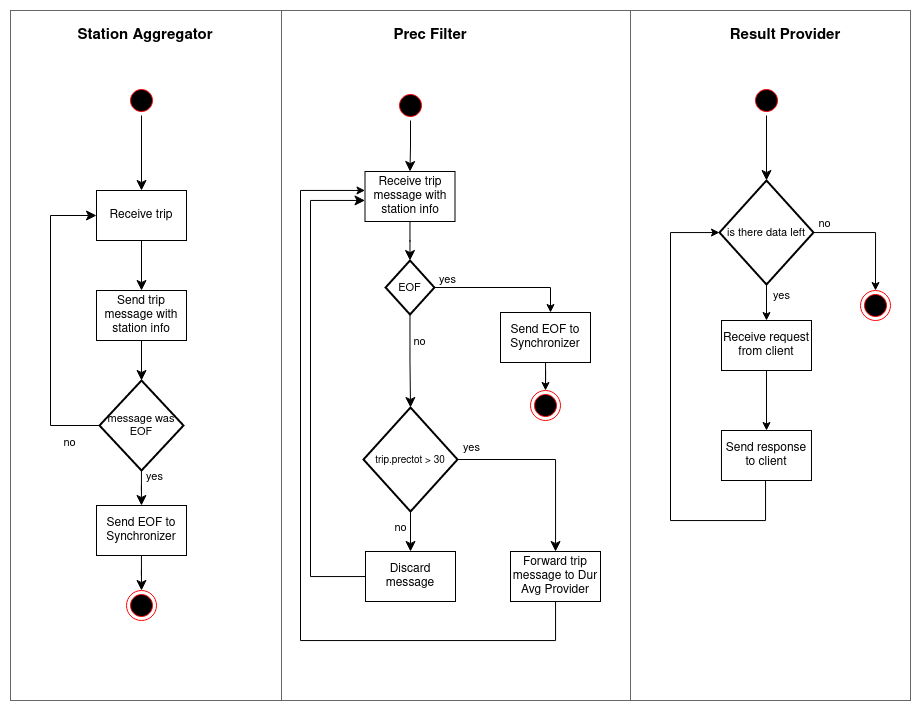

# TP1 - Sistemas Distribuidos I

## Tabla de contenidos

* [Documentación](#documentación)
    * [Alcance](#alcance)
    * [Arquitectura de Software](#arquitectura-de-software)
    * [Objetivos y limitaciones arquitectónicas](#objetivos-y-limitaciones-arquitectónicas)
    * [Escenarios](#escenarios)
    * [Vista Lógica](#vista-lógica)
        * [DAG](#dag)
    * [Vista Física](#vista-física)
        * [Diagrama de robustez](#diagrama-de-robustez)
        * [Diagrama de despliegue](#diagrama-de-despliegue)
    * [Vista de Procesos](#vista-de-procesos)
        * [Diagrama de actividad](#diagrama-de-actividad)

## Documentación

### Alcance

El proyecto consiste en un sistema distribuido que analice los registros de viajes
realizados con bicicletas de la red pública provista por grandes ciudades.

Se deben generar los siguientes reportes:

- La duración promedio de viajes que iniciaron en días con
  precipitaciones >30mm.
- Los nombres de estaciones que al menos duplicaron la cantidad de
  viajes iniciados en ellas entre 2016 y el 2017.
- Los nombres de estaciones de Montreal para la que el promedio de
  los ciclistas recorren más de 6km en llegar a ellas.

### Arquitectura de Software

La arquitectura es de tipo cliente-servidor, donde el servidor consiste en
diferentes entidades, comunicadas entre sí mediante el broker de mensajes
RabbitMQ.

### Objetivos y limitaciones arquitectónicas

- **Escalabilidad**: Se debe soportar el incremento de los elementos de cómputo para
  escalar los volúmenes de información a procesar.
- **Mantenibilidad**: La comunicación de grupos debe encapsularse en un middleware.

### Escenarios

Diagrama de casos de uso del sistema.

### Vista Lógica

#### DAG

DAG global del sistema.

En el diagrama se puede observar la división de responsabilidades entre los distintos componentes
del sistema. En primer lugar, el Gateway se encarga de distribuir la información recibida del cliente,
entre los aggregators. Cada aggregator opera con una side table que contiene un pequeño conjunto de
datos estáticos.

Para disminuir el tamaño de los mensajes que debe procesar RabbitMQ, el Gateway poda todos los
campos que no son necesarios para calcular los reportes.
Por ejemplo, el Gateway recibe una gran cantidad de información climática, pero el sistema solo
necesita la precipitación. Por lo tanto, el Gateway elimina todos los campos que no son necesarios
antes de enviar la información al aggregator.

La información de las side tables se ingresa al sistema mediante un mecanismo de pub-sub, para
permitir que varias réplicas de los aggregators puedan construir sus side tables.
Esto favorece la escalabilidad del sistema, a costa de duplicar la información en cada réplica.

### Vista Física

#### Diagrama de robustez

Diagrama de robustez simplificado

Como se puede ver, varias entidades del sistema pueden ser replicadas, para permitir un escalado
horizontal.

Algunas entidades poseen el estereotipo `<<City Affinity>>`. Esto quiere decir que, para dicha entidad,
existirá un nodo por cada ciudad. Por ejemplo, se deben desplegar tres instancias de `Dist Mean Calculator`.

Los aggregators, ademas de tener affinity con una ciudad, pueden replicarse. Por ejemplo, pueden desplegarse
3 `Weather Aggregator` para Washington, y 2 `Weather Aggregator` para Montreal.

Diagrama de robustez del servidor, con información de cada una de las queues.

En el diagrama anterior se observa la forma en que se distribuyen los mensajes entre los distintos
componentes del sistema. Además, se puede ver el mecanismo por el cual se dividen los mensajes en aquellos
nodos que poseen `<<City Affinity>>`: el nombre de la queue inicia con el nombre de la ciudad, seguido de un
guión bajo.

#### Diagrama de despliegue

Diagrama de despliegue del sistema.

Este diagrama pone en evidencia la fuerte dependencia que existe entre RabbitMQ (Message Queue) y
los diferentes componentes del sistema.
Para alivianar la carga del broker, el cliente y el Gateway se comunican directamente entre sí.
Cada nodo puede desplegarse de manera independiente.

### Vista de Procesos

#### Diagrama de actividad

Diagrama de actividad de la comunicación entre el cliente, el Gateway y el primer aggregator.

En el diagrama anterior se puede observar el orden en que el cliente envía la información al Gateway, y
el orden en que la esperan los aggregators.
Por un lado, el cliente envía la información del clima, estaciones y viajes.
El `Weather Aggregator` necesita la información climática para armar su side table, por lo que no puede
procesar la información de los viajes hasta que no reciba todos los datos del clima.
Lo mismo sucede con el `Station Aggregator`, que necesita la información de las estaciones.

Diagrama de actividad de la comunicación del `Station Aggregator` con el `Prec Filter` y `Distance Calculator`.

En el diagrama se visualiza cómo se comunica la información, desde el momento en que se termina de agregar
la información de las estaciones y el clima, hasta que se envía al primer conjunto de filtros y calculators.

Se ve que, tanto el `Prec Filter` como el `Distance Calculator`, pueden realizar su trabajo utilizando
exclusivamente la información del paquete que acaban de recibir, por lo que el escalado de éstas entidades
es muy sencillo.

